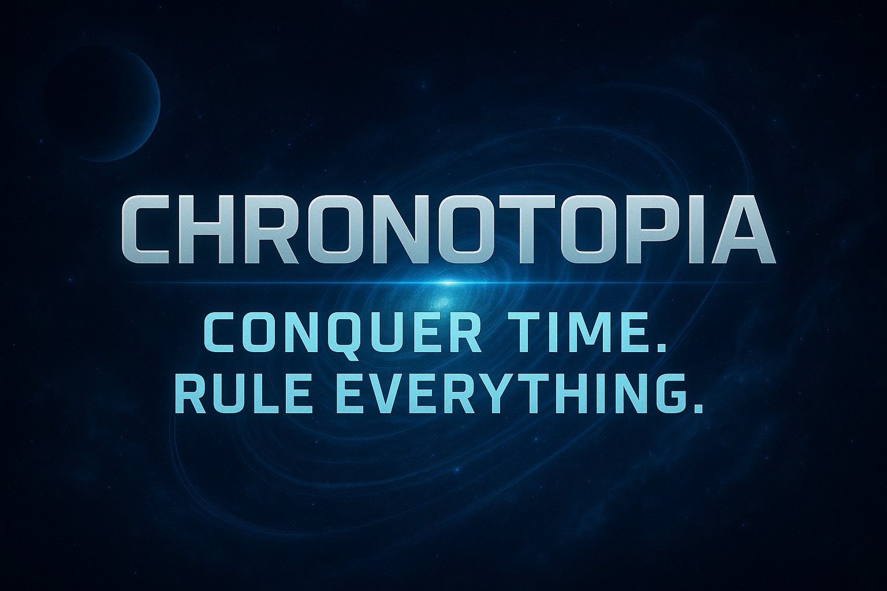

# Chronotopia



Chronotopia is a 4X space deckbuilding game built with Phaser, TypeScript, Vite, React and Zustand.

## Table of Contents

- [Project Goal](#project-goal)
- [MVP Roadmap](#mvp-roadmap)
- [Planned Features](#planned-features)
- [Core Mechanics](#core-mechanics)
- [Tech Stack](#tech-stack)
- [Getting Started](#getting-started)
- [Continuous Integration](#continuous-integration)
- [How to Contribute](#how-to-contribute)
- [License](#license)

## Project Goal

The objective is to release Chronotopia on Steam.

## MVP Roadmap

| Feature           | Status  |
| :---------------- | :-----: |
| Turn system       |  Done   |
| Resources system  |  Done   |
| Map system        |  Done   |
| Fleet system      |  Done   |
| Planet system     | Planned |
| Research system   | Planned |
| Victory system    | Planned |
| Card system       | Planned |
| Steam integration | Planned |

## Planned Features

- Extensive variety of card types, including fleets, buildings, technologies, events, commanders, items, and more
- 5 victory conditions (scientific, military, economic, diplomatic, survival)
- 3 factions with unique abilities and playstyles (Human, Ethyrian, Karnak)
- Unique commanders with special skills and traits
- Combat system (inspired by Heroes 3 Might & Magic)
- New systems:
    - Diplomacy (diplomatic relations, treaties, alliances)
    - Trade (trade routes, trade agreements, unique trade goods)
    - Tutorial
    - Espionage
    - Events
    - Missions
    - Politics (laws, elections, taxes, multiple systems: democracy, monarchy, technocracy, etc.)
    - Neutral factions
    - Items
    - Skills
    - Council
    - Artifacts
    - Achievements
    - Galactic senate
    - Ship customization (weapons, armor, engines, modules)
    - Happiness
    - Influence
    - Time travel mechanics
    - AI opponents (with different difficulty levels and personalities)
    - Ascension mode and card upgrade system (inspired by Slay the Spire and Hades)
    - etc.
- New galactic elements:
    - New planets
    - New fleet
    - Asteroids
    - Fog of war
    - Wormholes
    - Anomalies
    - Nebulae
    - Space Stations
    - Celestial Bodies
    - Derelict Vessels
    - Pirate Outposts
    - Black holes
    - Space monsters
    - Space weather
    - Stars
    - etc.

## Core Mechanics

- 4X gameplay: Explore, Expand, Exploit, Exterminate
- Deckbuilding mechanics
- Space strategy
- Built with modern web technologies

## Tech Stack

- [Phaser](https://phaser.io/) for game engine
- [TypeScript](https://www.typescriptlang.org/) for type-safe development
- [Vite](https://vitejs.dev/) for fast builds and hot module replacement
- [React](https://react.dev/) for UI components
- [Zustand](https://zustand-demo.pmnd.rs/) for state management

## Getting Started

### Prerequisites

- Node.js 22.x
- npm

### Installation

```bash
npm install
```

### Development

To start the development server:

```bash
npm run dev
```

### Build

To build the project for production:

```bash
npm run build
```

### Linting

To check code quality:

```bash
npm run lint
```

### Formatting

To format code:

```bash
npm run format
```

### Testing

To run unit tests:

```bash
npm run test:unit
```

## Continuous Integration

This project uses GitHub Actions for automated builds, tests, and code checks on every push or pull request to `main`.

See `.github/workflows/build-and-test.yml` for details.

## How to Contribute

Contributions are welcome! To contribute:

1. Fork the repository.
2. Clone your fork.
3. Create a new branch (featureName) from `main`.
4. Make your changes and ensure all tests pass.
5. Submit a pull request with a clear description of your changes.
6. For bug reports or feature requests, open an issue.

## License

This project doesn't have a license yet.
